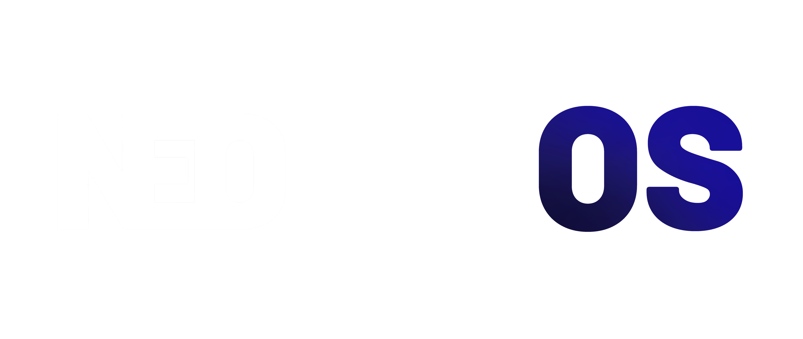
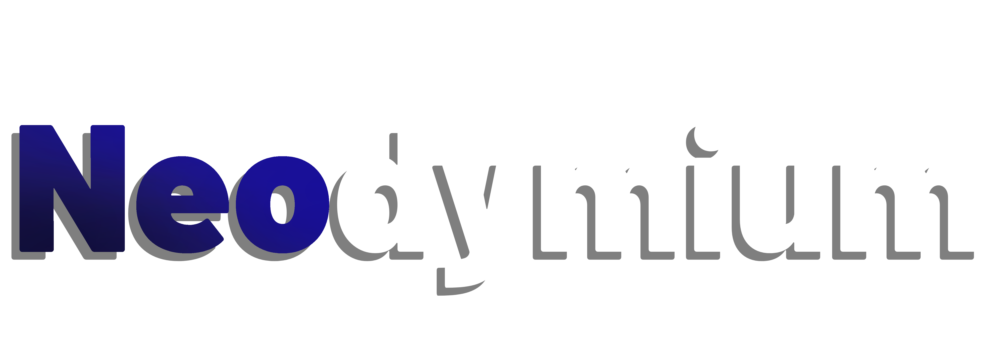

- 

**NeoLixOS** is a fast, lightweight, and flexible operating system designed for everyday use.

--------------------------
NeoLixOS currently offers four desktop environment editions:

-  **Neodymium (GNOME)** – GNOME based edition. Clean, modern, and focused. Designed for a smooth and productive daily experience.

-  **Neocelium (KDE Plasma)** – KDE Plasma based edition.Powerful, flexible, and highly customizable. Built for users who want full control over their desktop.

  
-  **Neopluma (Budgie)** – Budgie based edition. Elegant, minimal, and balanced. A modern interface with a familiar and comfortable workflow.

  
-  **Neolytum (XFCE)** – XFCE based edition. Fast, lightweight, and efficient. Ideal for performance focused users and low-end systems.

 All editions share the same Arch-based core. Choose the desktop that fits for you.
 

 ## These system builds are currently in development and not yet available.

 -----------------------------

 # NeoLixOS Terms and Conditions

Welcome to NeoLixOS! By using, downloading, or distributing NeoLixOS, you agree to the following terms:

## 1. License

NeoLixOS is licensed under the **GNU General Public License v3 (GPLv3)**.  
You are free to use, modify, and redistribute the software under the terms of this license.

## 2. Usage

- NeoLixOS is provided **as-is**. The developers are not responsible for any damage, data loss, or issues caused by using the software.  
- You may create derivative works or build your own distributions based on NeoLixOS.  

## 3. Logos and Images

- All NeoLixOS logos and images may be used for **personal purposes**, such as wallpapers or decorations.  
- You may not use any NeoLixOS logos, images, or branding for **commercial purposes** without explicit permission.  
- You may modify logos for personal projects in a non-commercial context.

## 4. No Warranty

NeoLixOS comes without any warranties. The developer make no guarantees about functionality, stability, or compatibility.  
Use at your own risk.

## 5. Intellectual Property

- The NeoLixOS name and logos are owned by the creator (NeoLixOS).  
- Referencing NeoLixOS in non-commercial projects is allowed.  

## 6. Updates and Support

- NeoLixOS may provide updates and new ISO releases.  
- Support is community-driven; no official technical support is guaranteed.

## 7. Changes to Terms

NeoLixOS may update these Terms and Conditions. By continuing to use the software, you accept any changes.

